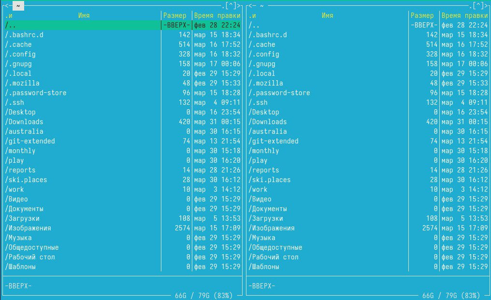
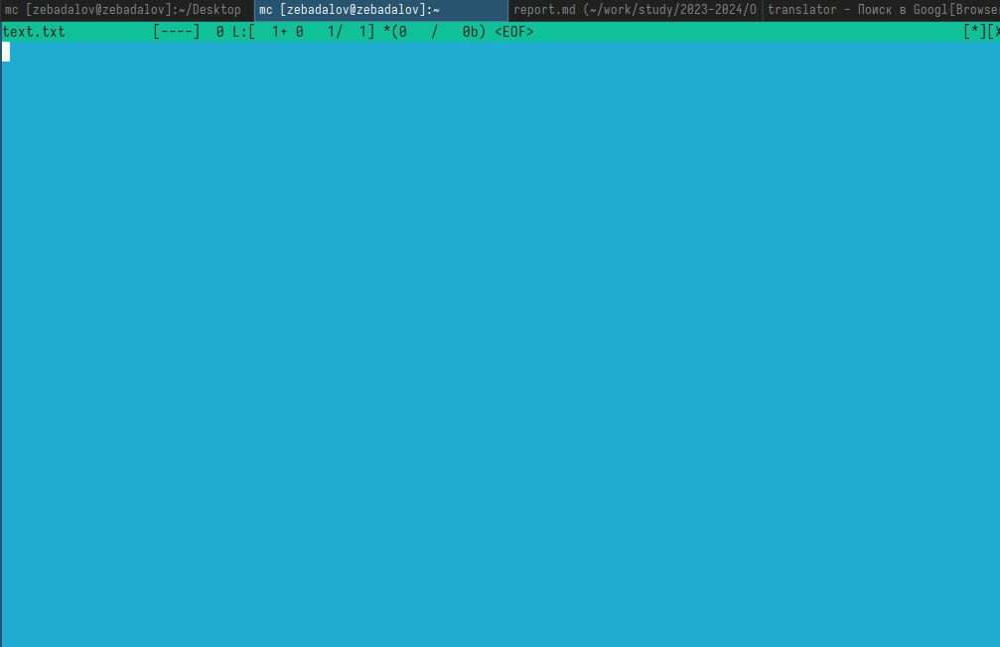
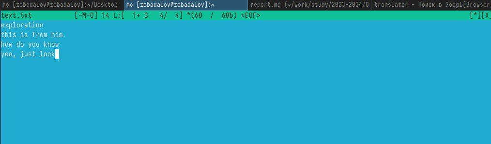
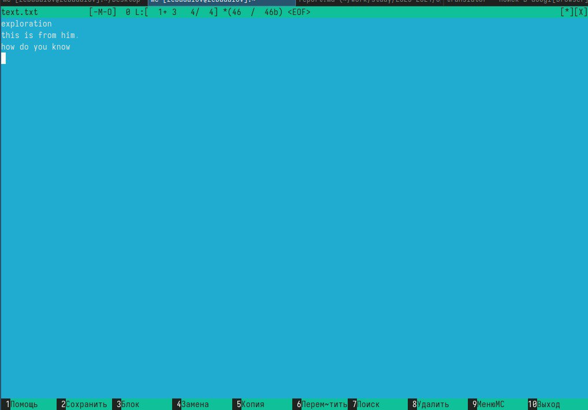
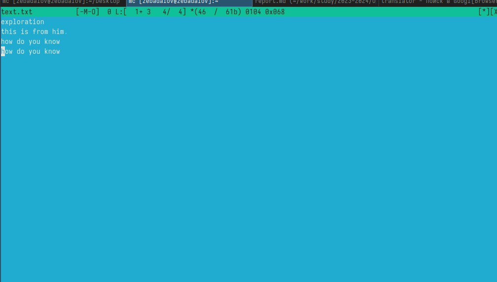
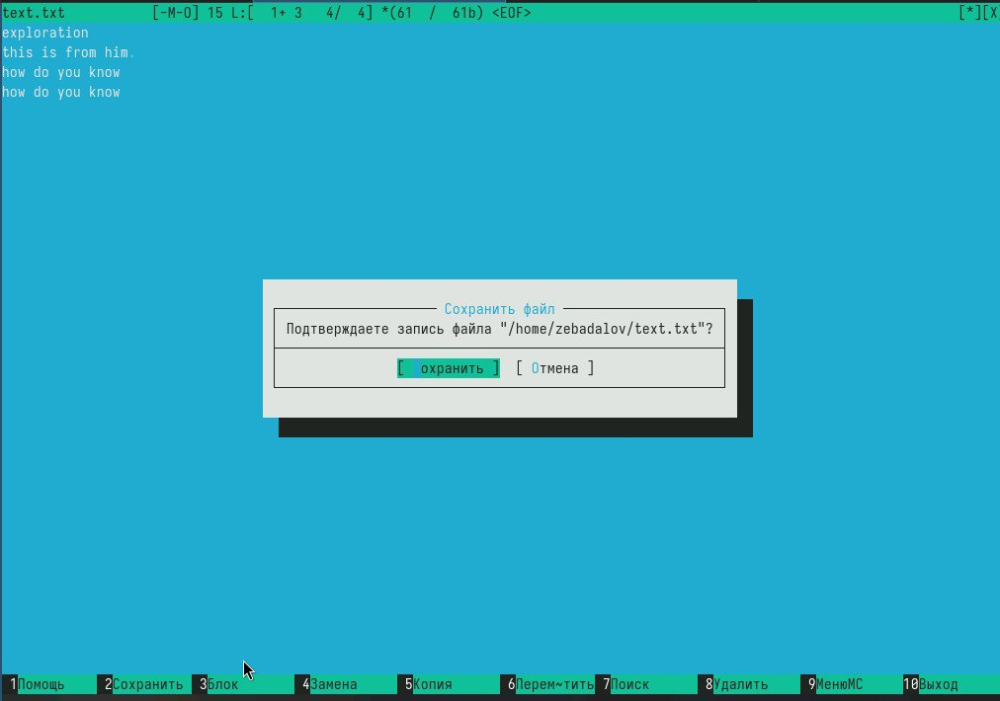

---
## Front matter
lang: ru-RU
title: Лабораторная работа №9
subtitle: Простейший шаблон
author:
  - Бадалов Заури Эльвин оглы

## i18n babel
babel-lang: russian
babel-otherlangs: english

## Formatting pdf
toc: false
toc-title: Содержание
slide_level: 2
aspectratio: 169
section-titles: true
theme: metropolis
header-includes:
 - \metroset{progressbar=frametitle,sectionpage=progressbar,numbering=fraction}
 - '\makeatletter'
 - '\beamer@ignorenonframefalse'
 - '\makeatother'

## Fonts
mainfont: PT Serif
romanfont: PT Serif
sansfont: PT Sans
monofont: PT Mono
mainfontoptions: Ligatures=TeX
romanfontoptions: Ligatures=TeX
sansfontoptions: Ligatures=TeX,Scale=MatchLowercase
monofontoptions: Scale=MatchLowercase,Scale=0.9
---

# Информация

## Докладчик

:::::::::::::: {.columns align=center}
::: {.column width="70%"}

  * Бадалов Заури Эльвин оглы
  * Студент
  * Российский университет дружбы народов
  * [1132236098@rudn.ru](mailto:1132236098@rudn.ru)
  
:::
::: {.column width="30%"}

:::
::::::::::::::

## Цели

Исследование основных возможностей Midnight Commander. Приобретение навыков практической работы по просмотру каталогов и файлов; манипуляций с ними.

## задачи

- приводится формулировка цели лабораторной работы. Формулировки
цели для каждой лабораторной работы приведены в методических
указаниях.

## man mc

Изучаю Midnight Commander, используя команду "man mc" 

## Midnight Commander

Midnight Commander

## text.txt 

Cоздаю файл text.txt 

## Oткрываю файл text.txt 

Oткрываю файл text.txt 

## Bставляю в файл text.txt текст 

## Используя горячие клавиши, удаляю строку текста 

Используя горячие клавиши, удаляю строку текста 

## Bыделяю фрагмент текста и пepeмещаю его на новую строку 

Bыделяю фрагмент текста и пepeмещаю его на новую строку 

## Oтменяю последнюю операцию и сохраняю файл 

Oтменяю последнюю операцию и сохраняю файл
 

## Выводы

Изучил основные возможности Midnight Commander.
