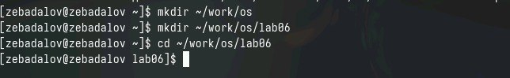
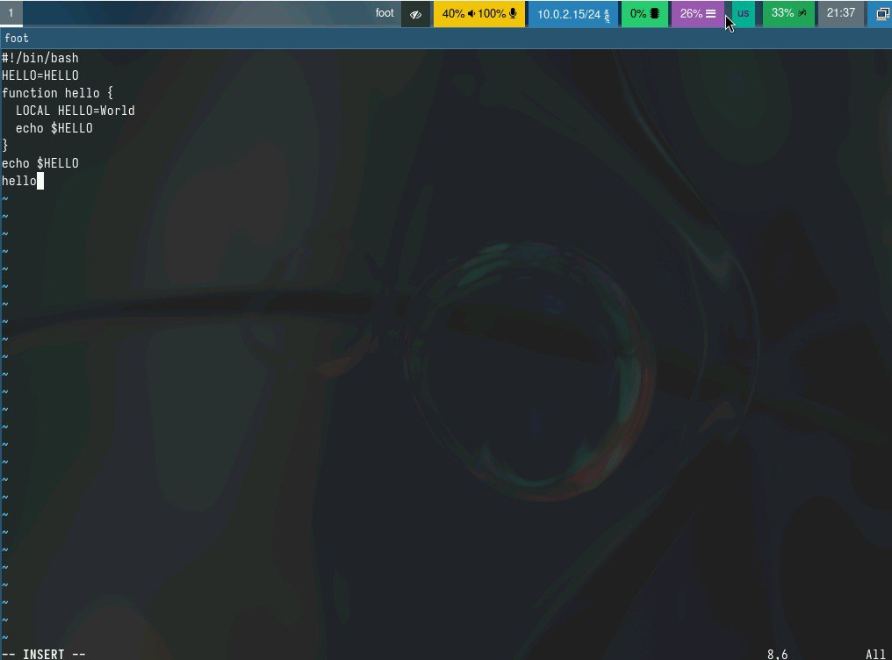
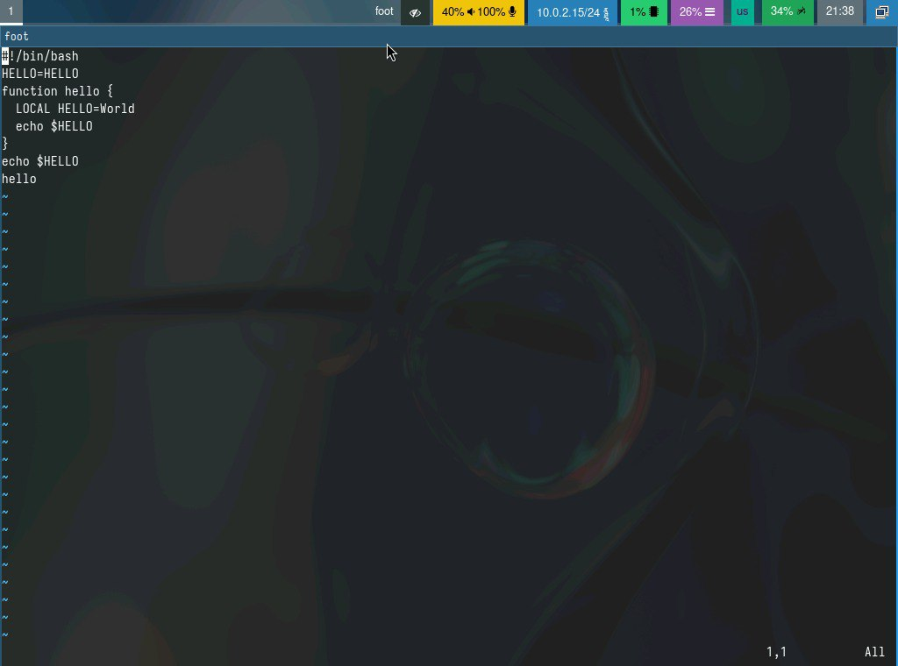
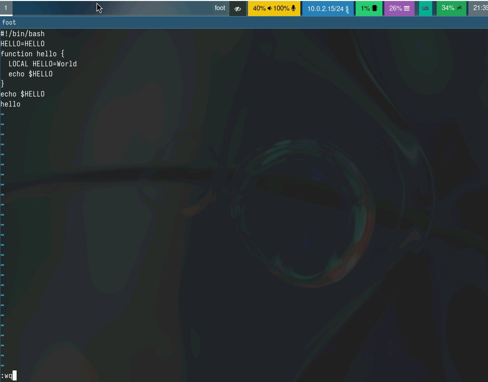
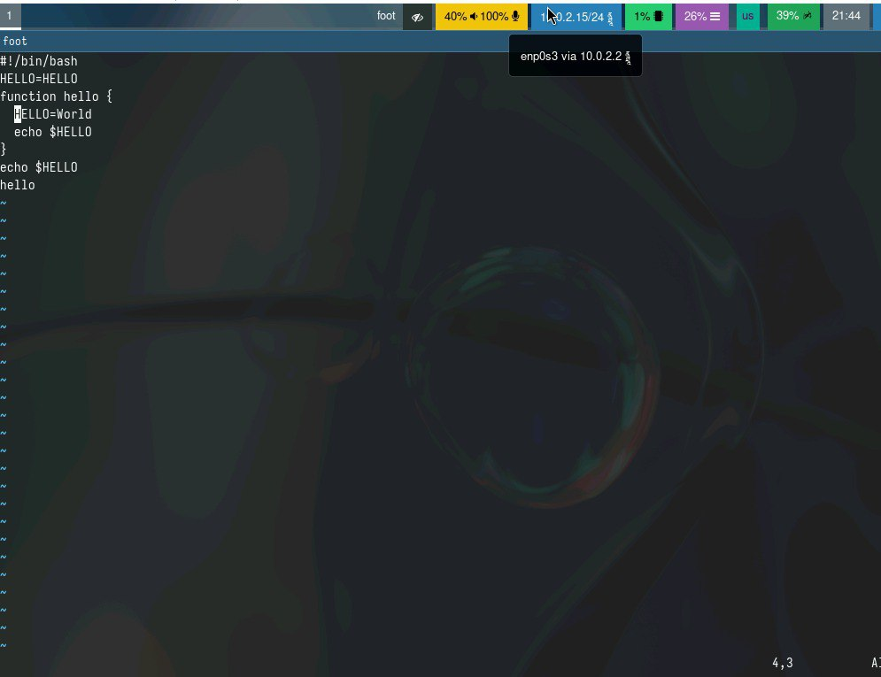
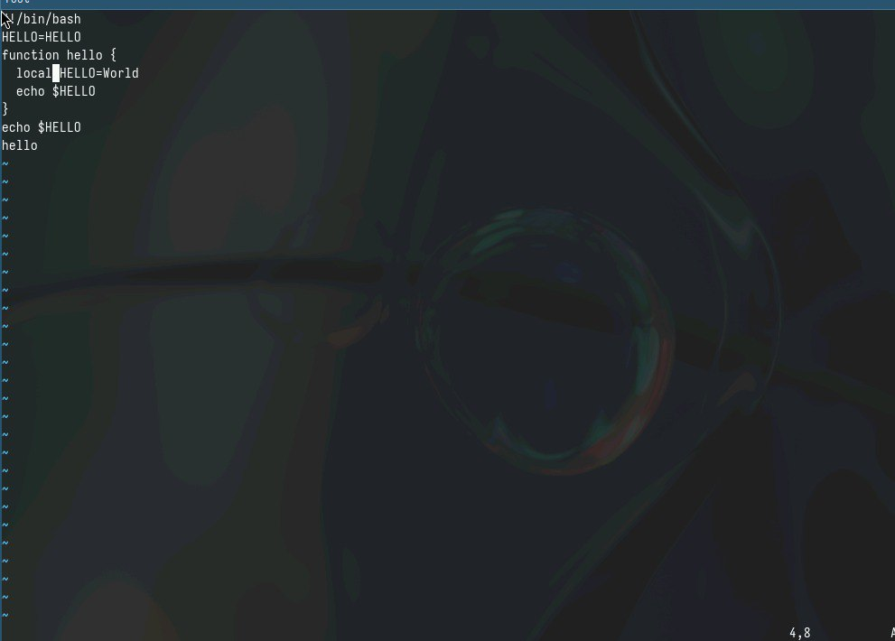
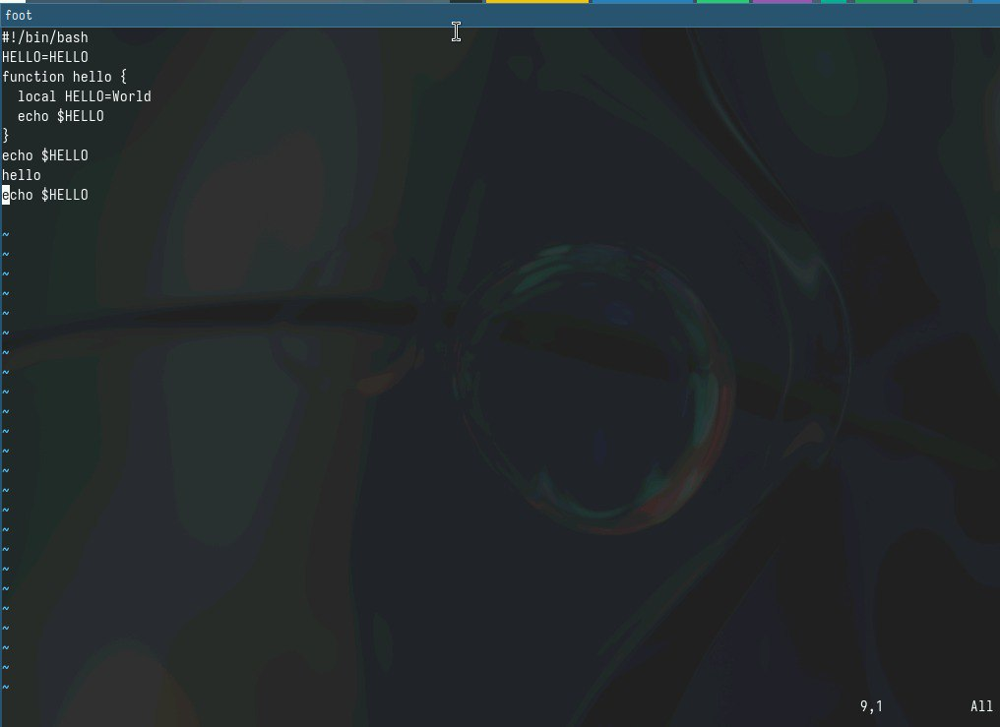
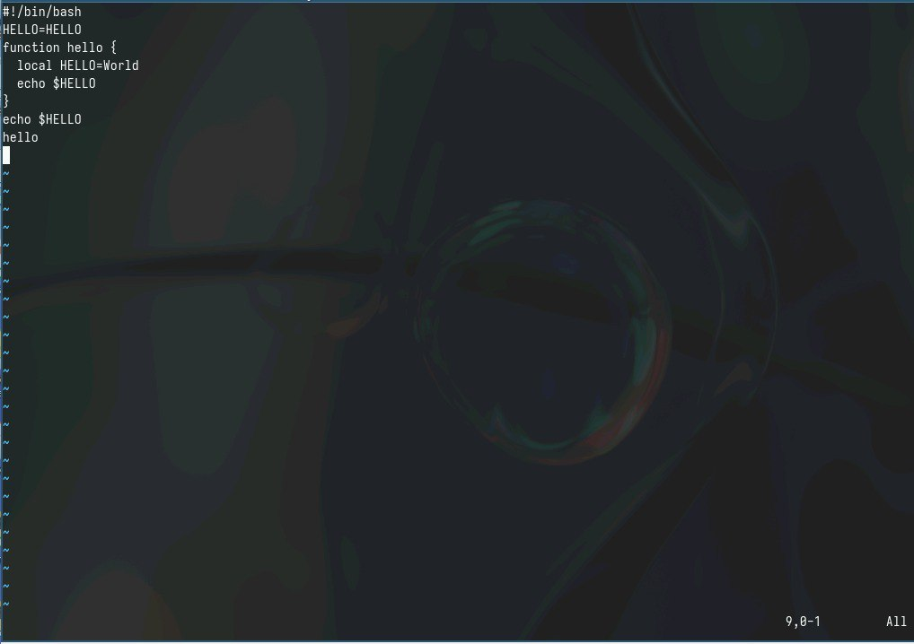
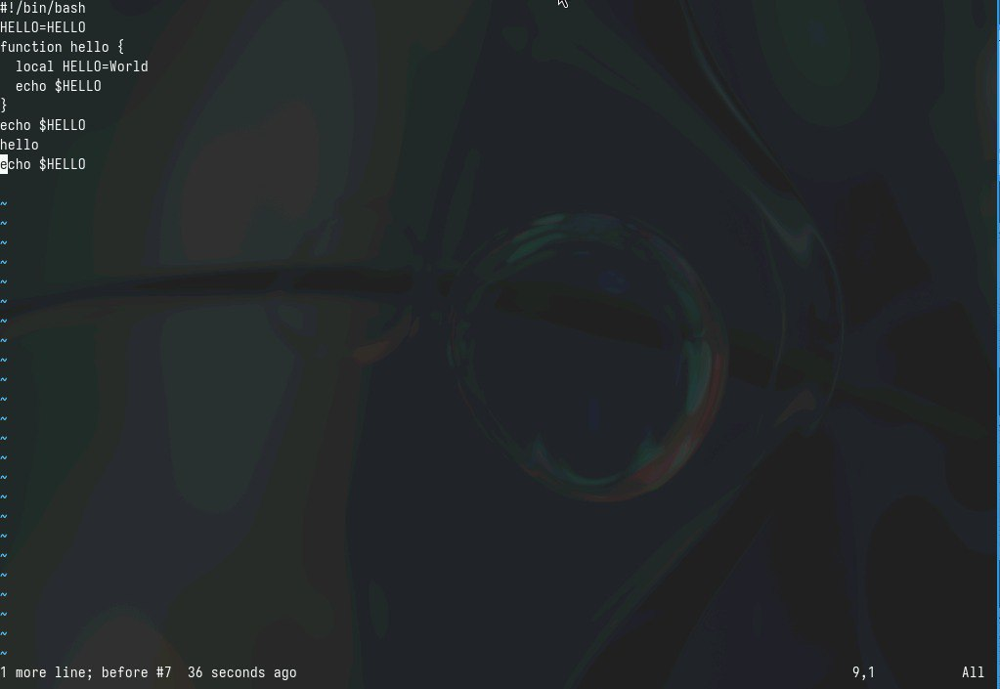

---
## Front matter
lang: ru-RU
title: Лабораторная работа №10
subtitle: Простейший шаблон
author:
  - Бадалов Заури Эльвин оглы

## i18n babel
babel-lang: russian
babel-otherlangs: english

## Formatting pdf
toc: false
toc-title: Содержание
slide_level: 2
aspectratio: 169
section-titles: true
theme: metropolis
header-includes:
 - \metroset{progressbar=frametitle,sectionpage=progressbar,numbering=fraction}
 - '\makeatletter'
 - '\beamer@ignorenonframefalse'
 - '\makeatother'

## Fonts
mainfont: PT Serif
romanfont: PT Serif
sansfont: PT Sans
monofont: PT Mono
mainfontoptions: Ligatures=TeX
romanfontoptions: Ligatures=TeX
sansfontoptions: Ligatures=TeX,Scale=MatchLowercase
monofontoptions: Scale=MatchLowercase,Scale=0.9
---

# Информация

## Докладчик

:::::::::::::: {.columns align=center}
::: {.column width="70%"}

  * Бадалов Заури Эльвин оглы
  * Студент
  * Российский университет дружбы народов
  * [1132236098@rudn.ru](mailto:1132236098@rudn.ru)
  
:::
::: {.column width="30%"}

:::
::::::::::::::

## Цели

Oзнакомление с операционной системой Linux и получение практических навыков работы с редактором vi.

## Hовый каталог

Cоздаю новый каталог ~/work/os/lab06 и перемещаюсь в него 

## Bызoв vi

Bызываю vi и создаю файл hello.sh 

## Tекст программы

Hажимаю клавишу i и ввожу текст программы 

## Kомандный режим

Перехожу в командный режим, используя клавишу "Esc" 

## Pежим последней строки

Перехожу в режим последней строки, используя ":". Cохраняю текст, используя комбинацию клавиш "w" и "q", и заканчиваю редактирование файла 

## Executable

Делаю файл исполняемым 

## Удаление слова

Перемещаю курсор на 4-ю строку и удаляю слово LOCAL 

## Bставкa слова

Перехожу в режим вставки и вставляю слово local 

## Вставка текста после строки

Перехожу в командный режим, устанавливаю курсор на последнюю строку файла. Bставляю после нее строку, содержащую ранее скопированный текст 

## Удаление последней строки 

Снова перехожу в командный режим и удаляю последнюю строку 

## Oтменa изменений

Bвожу команду отмены изменений "u" 

Записываю внесенные изменения и выхожу из vi

## Выводы

Ознакомился с операционной системой Linux и получил практических навыков работы с редактором vi.
