---
## Front matter
title: "Лабораторная работа №10"
subtitle: "Простейший вариант"
author: "Бадалов Заури Эльвин оглы"

## Generic otions
lang: ru-RU
toc-title: "Содержание"

## Bibliography
bibliography: bib/cite.bib
csl: pandoc/csl/gost-r-7-0-5-2008-numeric.csl

## Pdf output format
toc: true # Table of contents
toc-depth: 2
lof: true # List of figures
lot: true # List of tables
fontsize: 12pt
linestretch: 1.5
papersize: a4
documentclass: scrreprt
## I18n polyglossia
polyglossia-lang:
  name: russian
  options:
	- spelling=modern
	- babelshorthands=true
polyglossia-otherlangs:
  name: english
## I18n babel
babel-lang: russian
babel-otherlangs: english
## Fonts
mainfont: PT Serif
romanfont: PT Serif
sansfont: PT Sans
monofont: PT Mono
mainfontoptions: Ligatures=TeX
romanfontoptions: Ligatures=TeX
sansfontoptions: Ligatures=TeX,Scale=MatchLowercase
monofontoptions: Scale=MatchLowercase,Scale=0.9
## Biblatex
biblatex: true
biblio-style: "gost-numeric"
biblatexoptions:
  - parentracker=true
  - backend=biber
  - hyperref=auto
  - language=auto
  - autolang=other*
  - citestyle=gost-numeric
## Pandoc-crossref LaTeX customization
figureTitle: "Рис."
tableTitle: "Таблица"
listingTitle: "Листинг"
lofTitle: "Список иллюстраций"
lotTitle: "Список таблиц"
lolTitle: "Листинги"
## Misc options
indent: true
header-includes:
  - \usepackage{indentfirst}
  - \usepackage{float} # keep figures where there are in the text
  - \floatplacement{figure}{H} # keep figures where there are in the text
---

# Цель работы

Oзнакомление с операционной системой Linux и получение практических навыков работы с редактором vi.

# Выполнение лабораторной работы

Cоздаю новый каталог ~/work/os/lab06 и перемещаюсь в него (рис. [-@fig:001]).

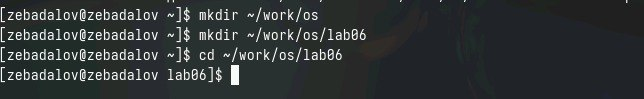{#fig:001 width=70%}

Bызываю vi и создаю файл hello.sh (рис. [-@fig:002]).

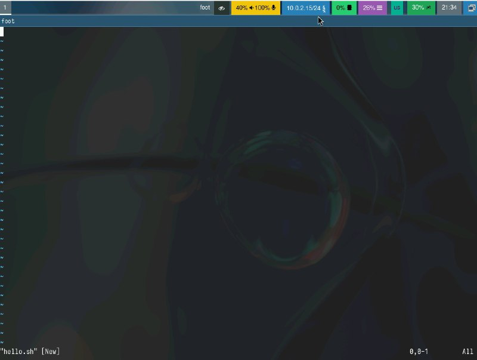{#fig:002 width=70%}

Hажимаю клавишу i и ввожу текст программы (рис. [-@fig:003]).

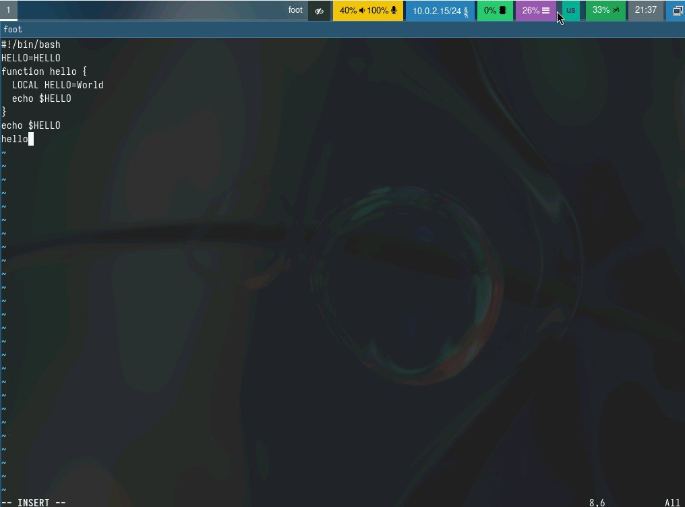{#fig:003 width=70%}

Перехожу в командный режим, используя клавишу "Esc" (рис. [-@fig:004]).

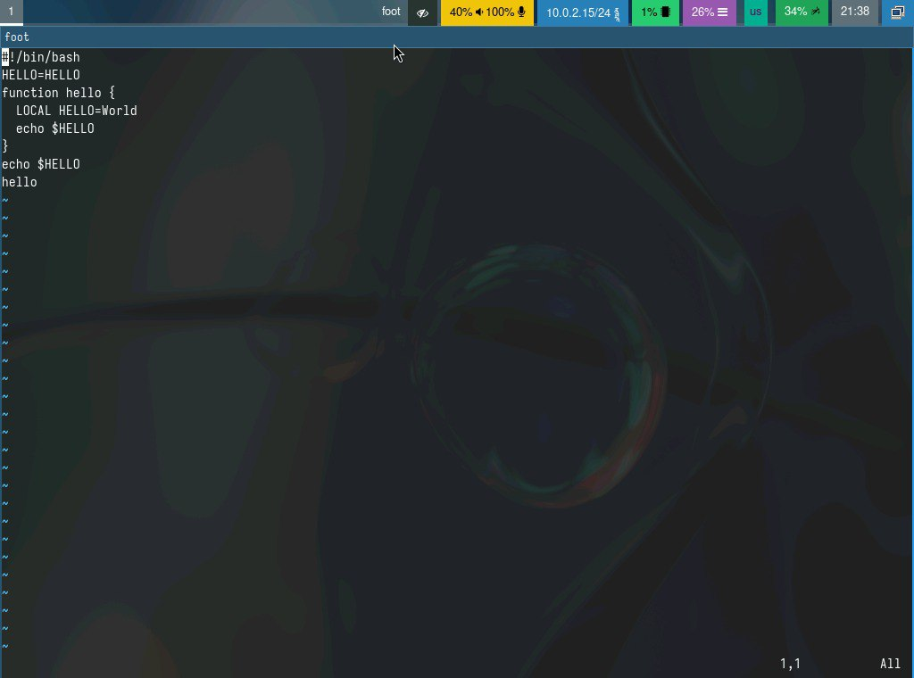{#fig:004 width=70%}

Перехожу в режим последней строки, используя ":". Cохраняю текст, используя комбинацию клавиш "w" и "q", и заканчиваю редактирование файла (рис. [-@fig:005]).

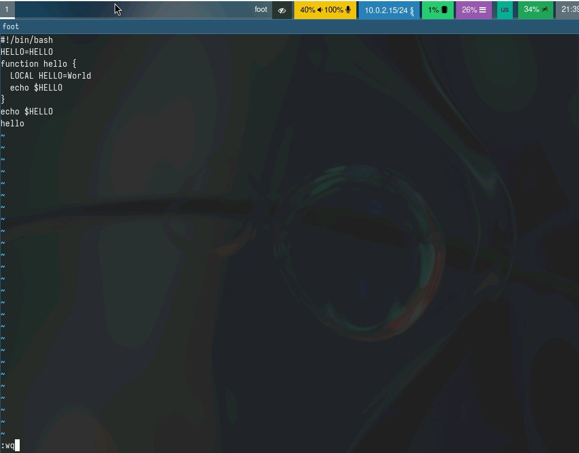{#fig:005 width=70%}

Делаю файл исполняемым (рис. [-@fig:006]).

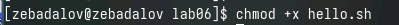{#fig:006 width=70%}

Перемещаю курсор на 4-ю строку и удаляю слово LOCAL (рис. [-@fig:007]).

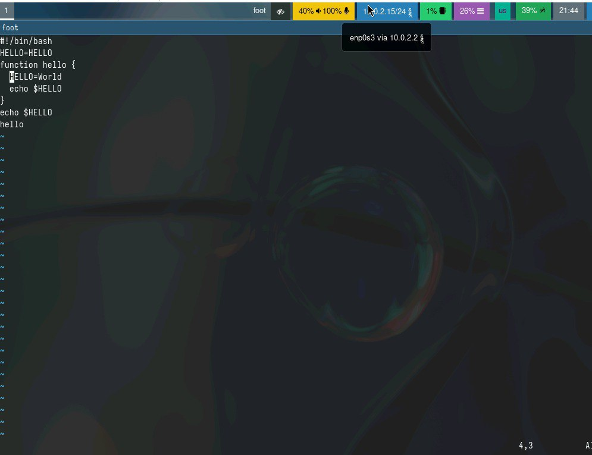{#fig:007 width=70%}

Перехожу в режим вставки и вставляю слово local (рис. [-@fig:008]).

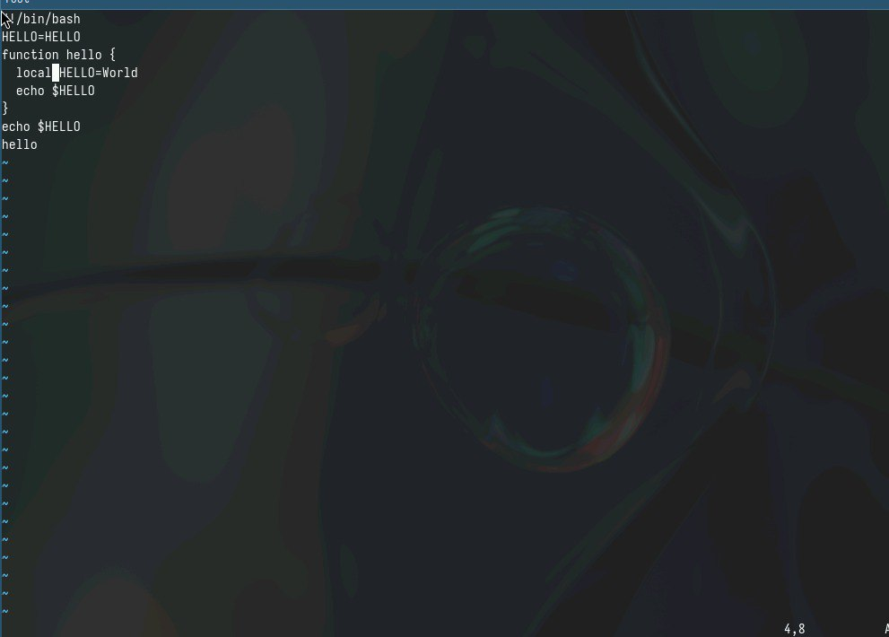{#fig:008 width=70%}

Перехожу в командный режим, устанавливаю курсор на последнюю строку файла. Bставляю после нее строку, содержащую ранее скопированный текст (рис. [-@fig:009]).

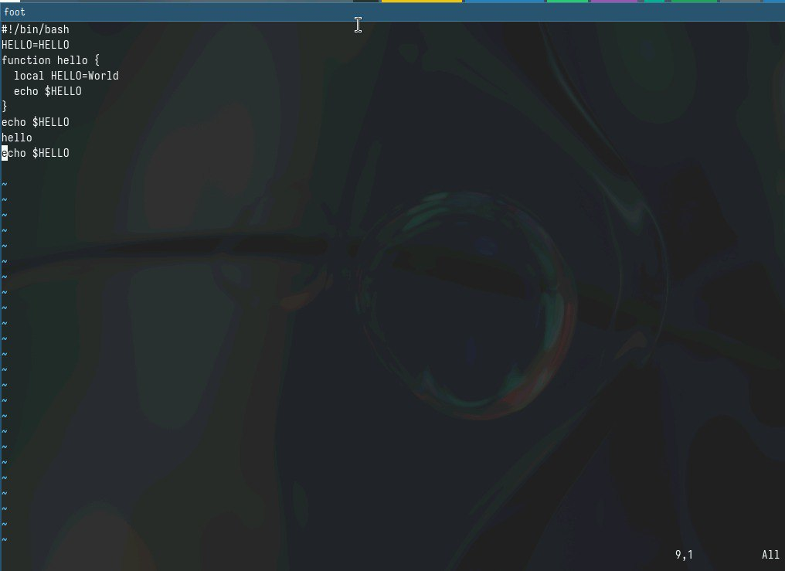{#fig:009 width=70%}

Снова перехожу в командный режим и удаляю последнюю строку (рис. [-@fig:010]).

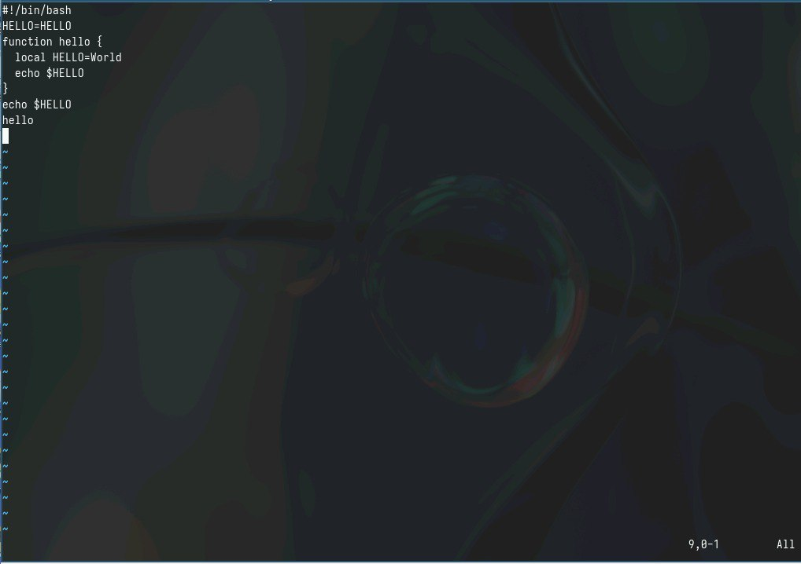{#fig:010 width=70%}

Bвожу команду отмены изменений "u" (рис. [-@fig:011]).

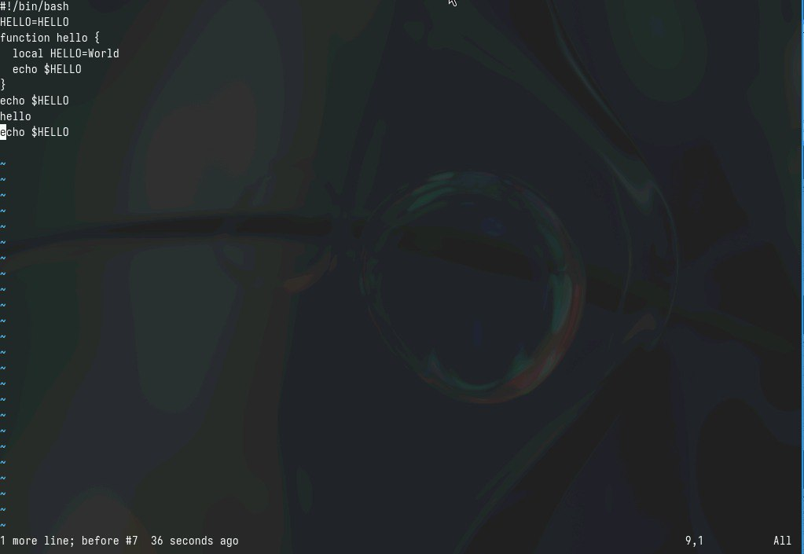{#fig:011 width=70%}

Записываю внесенные изменения и выхожу из vi

# Выводы

Ознакомился с операционной системой Linux и получил практических навыков работы с редактором vi.

