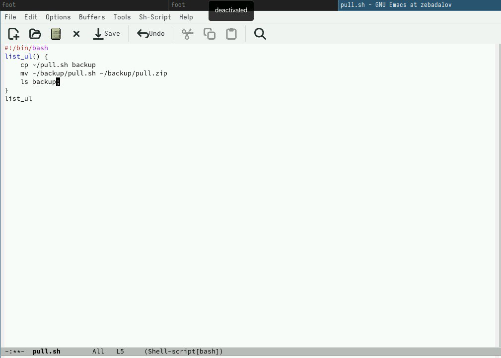
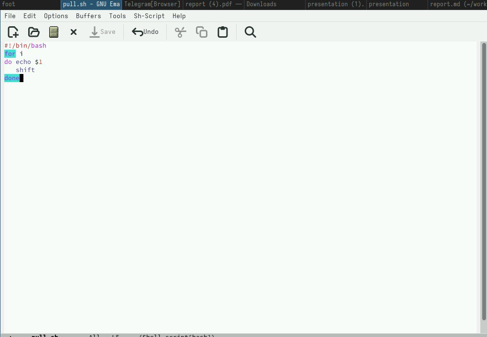
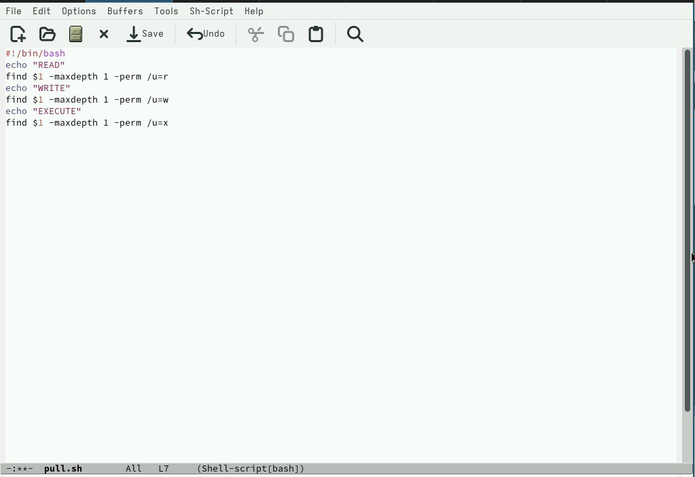

---
## Front matter
lang: ru-RU
title: Лабораторная работа №12
subtitle: Простейший шаблон
author:
  - Бадалов Заури Эльвин оглы

## i18n babel
babel-lang: russian
babel-otherlangs: english

## Formatting pdf
toc: false
toc-title: Содержание
slide_level: 2
aspectratio: 169
section-titles: true
theme: metropolis
header-includes:
 - \metroset{progressbar=frametitle,sectionpage=progressbar,numbering=fraction}
 - '\makeatletter'
 - '\beamer@ignorenonframefalse'
 - '\makeatother'

## Fonts
mainfont: PT Serif
romanfont: PT Serif
sansfont: PT Sans
monofont: PT Mono
mainfontoptions: Ligatures=TeX
romanfontoptions: Ligatures=TeX
sansfontoptions: Ligatures=TeX,Scale=MatchLowercase
monofontoptions: Scale=MatchLowercase,Scale=0.9
---

# Информация

## Докладчик

:::::::::::::: {.columns align=center}
::: {.column width="70%"}

  * Бадалов Заури Эльвин оглы
  * Студент
  * Российский университет дружбы народов
  * [1132236098@rudn.ru](mailto:1132236098@rudn.ru)
  
:::
::: {.column width="30%"}

:::
::::::::::::::

## Цели

Изучить основы программирования в оболочке ОС UNIX/Linux. Научиться пи-
сать небольшие командные файлы.

## Задание 1

1. Написали скрипт, который при запуске делает резервную копию самого
себя (то есть файла, в котором содержится его исходный код) в другую ди-
ректорию backup в моём домашнем каталоге. При этом файл архивируется
одним из архиваторов на выбор zip , bzip2 или tar . Способ использования
команд архивации узнали, изучив справку 

## Задание 2

2. Написали пример командного файла, обрабатывающего любое произволь-
ное число аргументов командной строки, в том числе превышающее де-
сять. Например, скрипт может последовательно распечатывать значения
всех переданных аргументов
for i — для всех переданных аргументов
do echo $1 — выводим первый аргумент
5shift — удаляем первый аргумент, смещаем все аргументы
done — конец цикла 

## 3адание 3

3. Написали командный файл — аналог команды ls (без использования самой
этой команды и команды dir ). Он выдает информацию о нужном каталоге
и выводит информацию о возможностях доступа к файлам этого каталога.
Комментарий: если не использовать команду ls или команду dir, то данную
задачу легко выполнить с помощью команды find, если указать ей опцию поиска
файлов с определенным правом доступа 

## 3адание 4

Написали командный файл, который получает в качестве аргумента ко-
мандной строки формат файла ( .txt , .doc , .jpg , .pdf и т.д.) и вычисляет
6количество таких файлов в указанной директории. Путь к директории так-
же передаётся в виде аргумента командной строки

## Выводы

В данной работе изучил основы программирования в оболочке ОС
UNIX/Linux. Научился писать небольшие командные файлы и скрипты на
языке bush.
