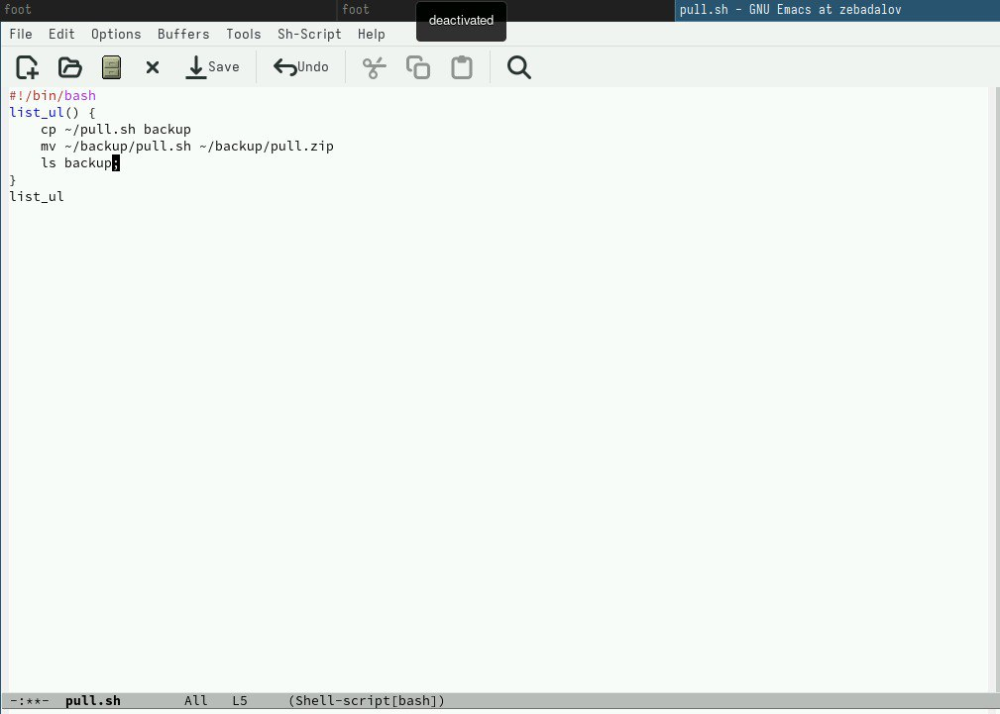
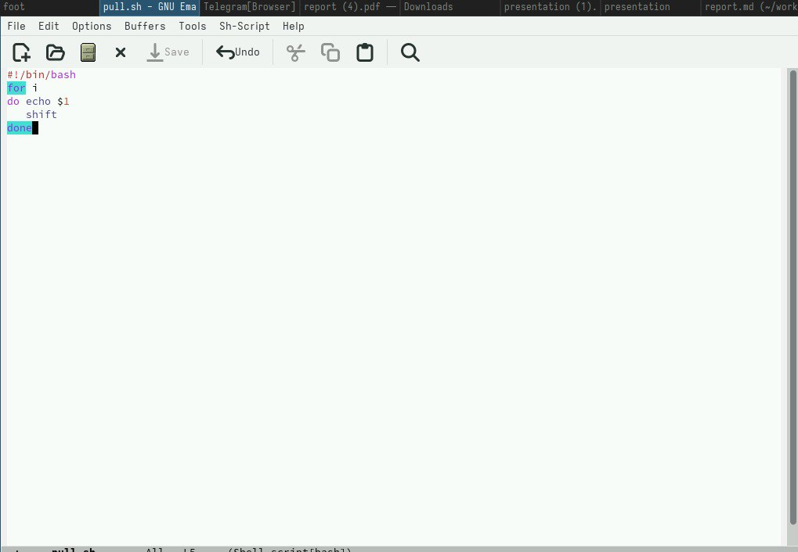
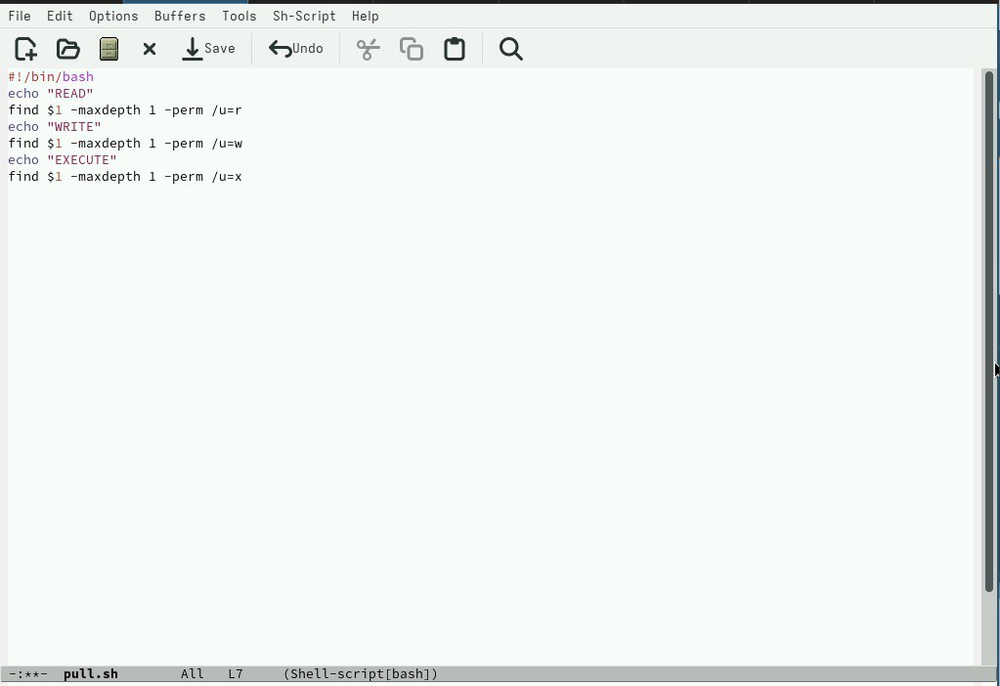

---
## Front matter
title: "Лабораторная работа №12"
subtitle: "Простейший вариант"
author: "Бадалов Заури Эльвин оглы"

## Generic otions
lang: ru-RU
toc-title: "Содержание"

## Bibliography
bibliography: bib/cite.bib
csl: pandoc/csl/gost-r-7-0-5-2008-numeric.csl

## Pdf output format
toc: true # Table of contents
toc-depth: 2
lof: true # List of figures
lot: true # List of tables
fontsize: 12pt
linestretch: 1.5
papersize: a4
documentclass: scrreprt
## I18n polyglossia
polyglossia-lang:
  name: russian
  options:
	- spelling=modern
	- babelshorthands=true
polyglossia-otherlangs:
  name: english
## I18n babel
babel-lang: russian
babel-otherlangs: english
## Fonts
mainfont: PT Serif
romanfont: PT Serif
sansfont: PT Sans
monofont: PT Mono
mainfontoptions: Ligatures=TeX
romanfontoptions: Ligatures=TeX
sansfontoptions: Ligatures=TeX,Scale=MatchLowercase
monofontoptions: Scale=MatchLowercase,Scale=0.9
## Biblatex
biblatex: true
biblio-style: "gost-numeric"
biblatexoptions:
  - parentracker=true
  - backend=biber
  - hyperref=auto
  - language=auto
  - autolang=other*
  - citestyle=gost-numeric
## Pandoc-crossref LaTeX customization
figureTitle: "Рис."
tableTitle: "Таблица"
listingTitle: "Листинг"
lofTitle: "Список иллюстраций"
lotTitle: "Список таблиц"
lolTitle: "Листинги"
## Misc options
indent: true
header-includes:
  - \usepackage{indentfirst}
  - \usepackage{float} # keep figures where there are in the text
  - \floatplacement{figure}{H} # keep figures where there are in the text
---

# Цель работы

Изучить основы программирования в оболочке ОС UNIX/Linux. Научиться пи-
сать небольшие командные файлы.

# Выполнение лабораторной работы

1. Написали скрипт, который при запуске делает резервную копию самого
себя (то есть файла, в котором содержится его исходный код) в другую ди-
ректорию backup в моём домашнем каталоге. При этом файл архивируется
одним из архиваторов на выбор zip , bzip2 или tar . Способ использования
команд архивации узнали, изучив справку (рис. [-@fig:001]).

{#fig:001 width=70%}

2. Написали пример командного файла, обрабатывающего любое произволь-
ное число аргументов командной строки, в том числе превышающее де-
сять. Например, скрипт может последовательно распечатывать значения
всех переданных аргументов
for i — для всех переданных аргументов
do echo $1 — выводим первый аргумент
5shift — удаляем первый аргумент, смещаем все аргументы
done — конец цикла (рис. [-@fig:002]).

{#fig:002 width=70%}

3. Написали командный файл — аналог команды ls (без использования самой
этой команды и команды dir ). Он выдает информацию о нужном каталоге
и выводит информацию о возможностях доступа к файлам этого каталога.
Комментарий: если не использовать команду ls или команду dir, то данную
задачу легко выполнить с помощью команды find, если указать ей опцию поиска
файлов с определенным правом доступа (рис. [-@fig:003]).

{#fig:003 width=70%}

Написали командный файл, который получает в качестве аргумента ко-
мандной строки формат файла ( .txt , .doc , .jpg , .pdf и т.д.) и вычисляет
6количество таких файлов в указанной директории. Путь к директории так-
же передаётся в виде аргумента командной строки

# Выводы

В данной работе изучил основы программирования в оболочке ОС
UNIX/Linux. Научился писать небольшие командные файлы и скрипты на
языке bush.

